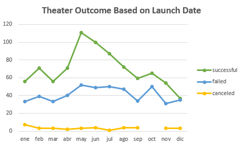
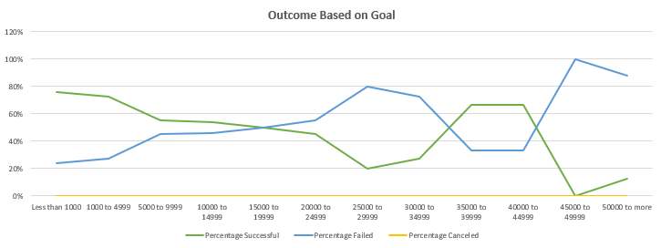

# Kickstarting with Excel

## Overview of Project

### Purpose
A project overview is a detailed description of a project's goals and objectives, the steps to achieve these goals, and the expected outcomes. In addition, a project overview enables you to outline the project schedule, budget, necessary resources, and status.

- *Instrucciones* - Purpose and background are well defined

- Ejemplo - Create a social media marketing campaign for the company's new skincare line that increases brand awareness and sales.

- Inicio - Give Louise an analysis with a detailed insight of trends of the different campaigns fared in relation to their launch dates and their funding goals.

## Analysis and Challenges

### Analysis of Outcomes Based on Launch Date

The next graph is comparing **Theater Outcomes vs. Launch** of the category of *Theater*, but taking in mind only the *successful*, *failed*, and *canceled* outcomes on their launch date. Also, the graph is showing the 3 selected outcomes and their behavior through the months of the years contained in the database.

    As first instance conclusion, we can observe that the 3 outcomes behave quite different one from another. There's no similarity between them.

### Analysis of Outcomes Based on Goals

The next graph is comparing **Outcomes vs. Goals** of the whole categories and subcategories, but also taking in mind only the *successful*, *failed*, and *canceled* outcomes. As well, for a better understanding of the information, it is presented into percentages to show the trends of some prestablished ranges of money outcomes per campaign. (The money ranges were established with a diference of 4,999 USD, except less than 1,000 USD and more than 50,000 USD; for example, 1,000 to 4,999 - 5,000 to 9,999 - 10,000 to 14,999 - etc)

    As first instance conclusion, we can observe that the 3 outcomes behave quite different one from another. There's no similarity between them.

### Challenges and Difficulties Encountered

- *Instrucciones* - Challenges or difficulties encountered, and how they were overcome, are well explained. OR, possible challenges or difficulties are described

- Pregunta Office Hours - ¿Del ejercicio o para Louise?

## Results

- *Instrucciones* - Two conclusions made about the Theater Outcomes by Launch Date, and there is a conclusion on the Outcomes based on Goals.
- *Instrucciones* - There is a summary of the limitations of the dataset, OR there is a recommendation for additional tables or graphs.

- What are two conclusions you can draw about the Outcomes based on Launch Date?

  - The Theater category have a great number of successful projects that were funded, from a total of 1,369,
   - 839 requests were successful. This is more than the half of the total.
  - As we can see the best months to launch a Theater campaign are *May*, *June*, or *July* (in that order), they are the most successful months of the analysis. In addition, as a recomendation, the month that shouldn't been consider is *December*, because apart from the fact that it is the lowest of the success rate, it is almost equal to the results that failed; 37 > 35 - a difference of 2 campaigns. 

- What can you conclude about the Outcomes based on Goals?

  - ?????????????????????????????

- What are some limitations of this dataset?

  - Taking in mind the information is required for a campaign for 2022, the data is quite outdated. The database is from 2009 to 2017.
  - ?????????????????????????????

- What are some other possible tables and/or graphs that we could create?

  - A table to check the range days between Deadline date and Launch date, to check if there's a correlation between the successful campaigns and that range.
  - A graph of the subcategories from the Theater to check which ones are more successful.
  - ????????????????????????????

- Pregunta Office Hours - Solicitar sugerencia de si responder las preguntas directamente con las conclusiones (a los bullets) o escribir una conclusión "formal".